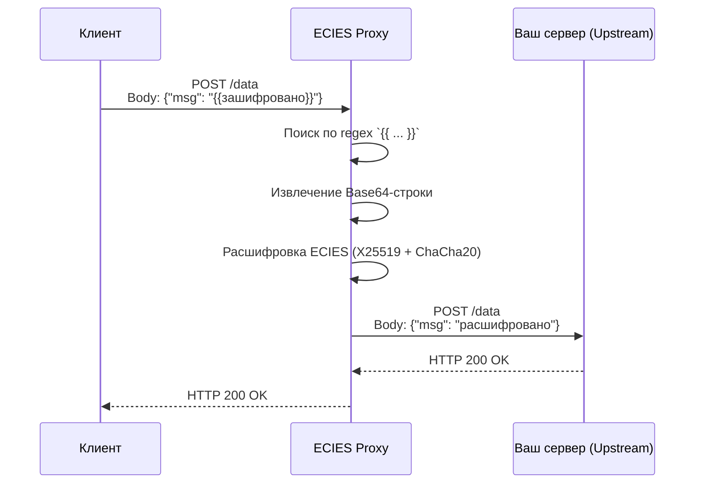
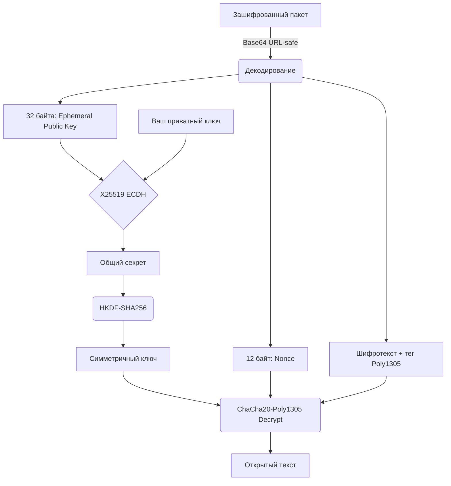
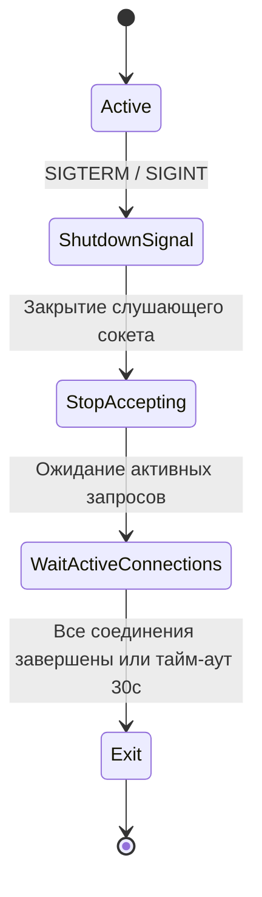
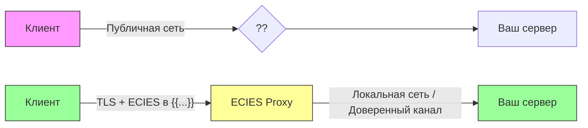
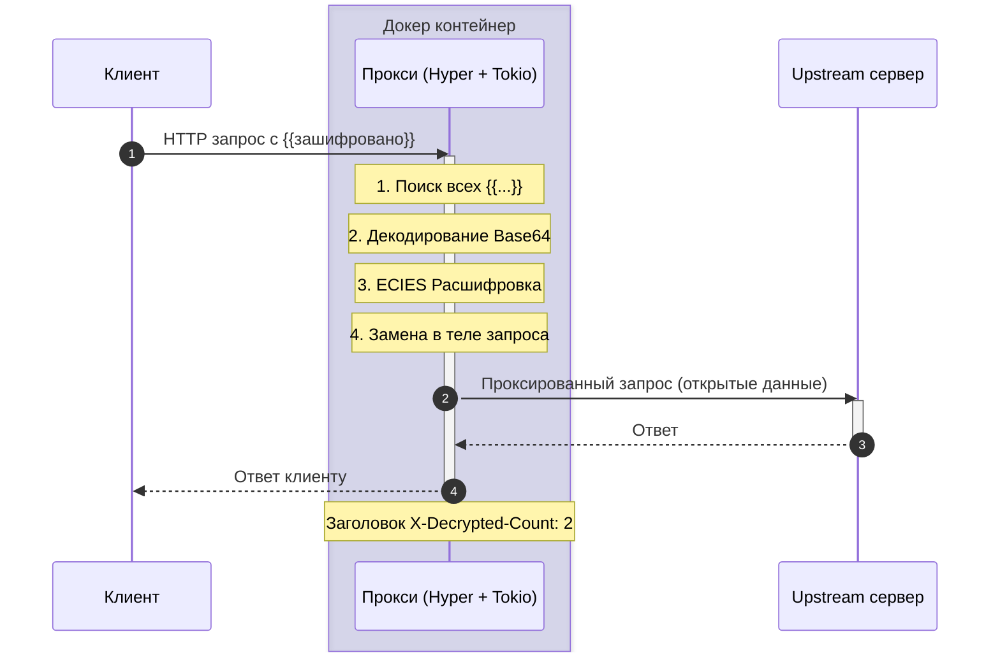
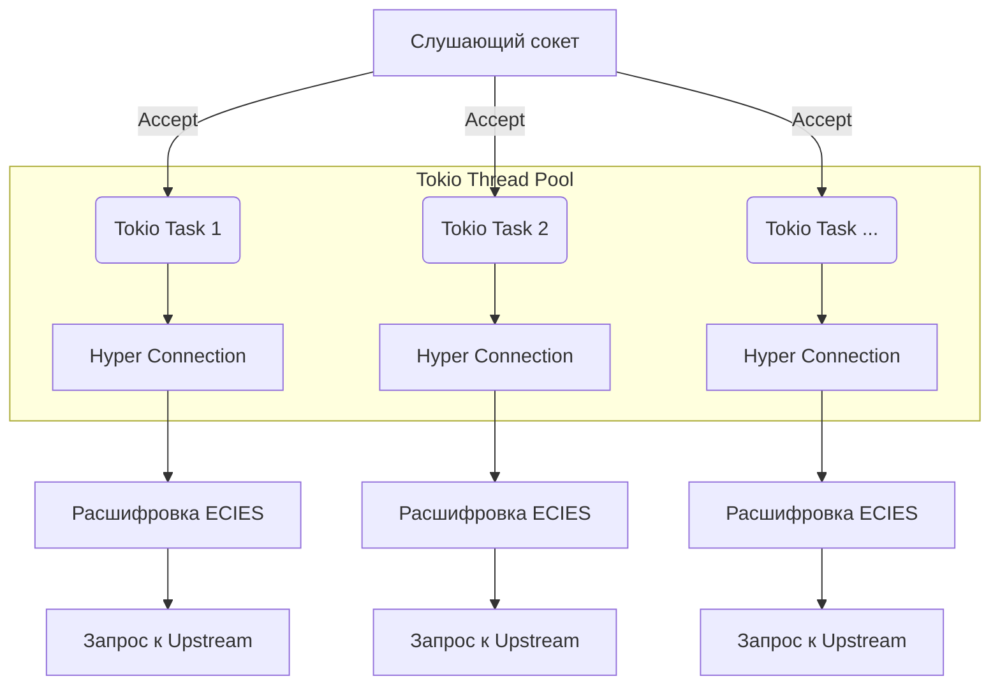
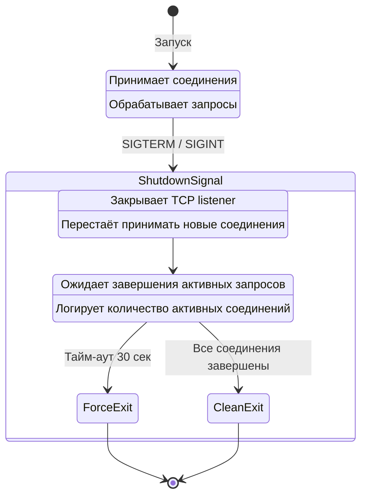

# 🔐 ECIES Reverse Proxy

[](https://www.rust-lang.org/)
[](https://www.docker.com/)
[](https://opensource.org/licenses/MIT)

Высокопроизводительный асинхронный прокси‑сервер для прозрачной расшифровки ECIES‑пакетов в HTTP‑трафике.  
Позволяет развернуть end‑to‑end шифрование, не меняя исходный код ваших сервисов.

---

## 📖 Содержание

- [Принцип работы](#-принцип-работы)
- [Алгоритмы шифрования](#-алгоритмы-шифрования)
- [Ключевые преимущества](#-ключевые-преимущества)
- [Отказоустойчивость](#-отказоустойчивость)
- [Быстрый старт](#-быстрый-старт)
- [Конфигурация](#-конфигурация)
- [Пример использования](#-пример-использования)
- [Лицензия](#-лицензия)

---

## 🧠 Принцип работы

Прокси перехватывает HTTP‑запросы, находит в теле зашифрованные блоки вида `{{Base64URL_Safe_String}}`, расшифровывает их с помощью вашего приватного ключа X25519 и передаёт уже открытые данные на конечный сервер (upstream).  
Ваше приложение получает чистые данные, а клиент может не беспокоиться о том, что его трафик будет раскрыт — вся магия происходит в контейнере.



---

## 🔐 Алгоритмы шифрования

Прокси реализует схему **ECIES** (Elliptic Curve Integrated Encryption Scheme) — одну из самых современных и быстрых схем асимметричного шифрования.

| Компонент | Алгоритм | Детали |
|-----------|----------|--------|
| **Соглашение о ключе** | X25519 (Curve25519) | Обмен 32‑байтными ключами. ~128 бит стойкости. |
| **Производный ключ** | HKDF‑SHA256 | info = `"ecies-chacha20-poly1305"` |
| **Симметричное шифрование** | ChaCha20‑Poly1305 | Аутентифицированное шифрование с 256‑битным ключом и 96‑битным nonce |



---

## 🚀 Ключевые преимущества

- 🔒 **End‑to‑End шифрование** – данные остаются зашифрованными до последнего звена перед вашим сервером.
- ⚡ **Высокая производительность** – асинхронный ввод‑вывод на `Tokio` и легковесный HTTP‑сервер `Hyper` позволяют обрабатывать тысячи соединений.
- 🧩 **Прозрачная интеграция** – никаких изменений в бизнес‑логике. Прокси полностью скрыт от остальной системы.
- 🎯 **Точечная замена** – расшифровываются только данные в шаблоне `{{...}}`, остальной контент остаётся нетронутым.
- 🛟 **Отказоустойчивость** – корректное завершение без потери запросов (Graceful Shutdown).
- 📦 **Простое развёртывание** – готовый Docker‑образ, конфигурация через переменные окружения.

---

## 🛡️ Отказоустойчивость

При получении сигнала `SIGTERM` или `SIGINT` прокси **не обрывает** соединения, а плавно завершает работу:

1. Перестаёт принимать новые TCP‑соединения.
2. Ожидает завершения обработки всех активных запросов (до 30 секунд).
3. Только после этого процесс корректно завершается.



Структурированное логирование позволяет наблюдать за состоянием через `docker compose logs`.

---

## 🏁 Быстрый старт

### 1. Подготовьте приватный ключ

Сгенерируйте ключи, например, с помощью Python или вашей 1С‑компоненты. Вам нужен **приватный** ключ в Base64 URL‑safe без паддинга, длиной 32 байта.

```bash
# Пример ключа (НЕ ИСПОЛЬЗОВАТЬ В БОЮ)
export ECIES_PRIVATE_KEY="Pz8_Pz8_Pz8_Pz8_Pz8_Pz8_Pz8_Pz8"
```

### 2. Запуск через Docker Compose

Создайте файл `docker-compose.yml`:

```yaml
services:
  proxy:
    image: ghcr.io/your-username/ecies-proxy:latest
    ports:
      - "8080:8080"
    environment:
      - ECIES_PRIVATE_KEY=${ECIES_PRIVATE_KEY}
      - UPSTREAM_URL=http://your-app:80
      - LISTEN_ADDR=0.0.0.0:8080
    restart: unless-stopped
```

Запустите:

```bash
docker compose up -d
```

---

## ⚙️ Конфигурация

| Переменная окружения | По умолчанию | Описание |
|----------------------|--------------|----------|
| `ECIES_PRIVATE_KEY` | *обязательно* | Приватный ключ ECIES в кодировке URL‑safe Base64 (без `=`). |
| `UPSTREAM_URL` | `http://localhost:8000` | Адрес вашего сервера, куда будут перенаправлены запросы. |
| `LISTEN_ADDR` | `0.0.0.0:8080` | Порт, на котором прокси принимает соединения. |

---

## 📮 Пример использования

```bash
# Зашифрованные данные (сгенерированы клиентом)
curl -X POST http://localhost:8080/ \
  -H "Content-Type: application/json" \
  -d '{"message": "{{зашифрованный_base64_здесь}}"}'
```

Прокси найдёт `{{зашифрованный_base64_здесь}}`, расшифрует его и отправит на `UPSTREAM_URL`:

```json
{
  "message": "секретные данные"
}
```

---

## 📄 Лицензия

Распространяется под лицензией **MIT**.


---

## Презентационные материалы

Ниже представлены слайды с диаграммами Mermaid и описанием. Код Mermaid можно вставить в [Mermaid Live Editor](https://mermaid.live/) или в любое markdown‑совместимое средство просмотра.

### Слайд 1: Проблема и решение

**Как передать секретные данные через публичный канал?**



### Слайд 2: Архитектура ECIES Proxy



### Слайд 3: Детали алгоритма ECIES

```mermaid
graph TD
    subgraph "Входные данные"
    PKG[Зашифрованный пакет {{...}}]
    end

    subgraph "ECIES Decryption"
    PKG --> Decode[Base64 URL-safe Decode]
    Decode --> EphPub[Эфемерный публичный ключ<br/>32 байта]
    Decode --> Nonce[Nonce<br/>12 байт]
    Decode --> Cipher[Шифротекст + тег Poly1305]
    
    Priv[Ваш приватный ключ] --> DH{X25519 ECDH}
    EphPub --> DH
    DH --> Shared[Общий секрет]
    
    Shared --> HKDF[<b>HKDF-SHA256</b><br/>info=ecies-chacha20]
    HKDF --> SymKey[Симметричный ключ 32 байта]
    
    SymKey --> Decrypt{ChaCha20-Poly1305}
    Nonce --> Decrypt
    Cipher --> Decrypt
    Decrypt -->|✅ Успех| Plain[Открытый текст]
    Decrypt -->|❌ Ошибка| Err[Пакет не тронут]
    end
```

### Слайд 4: Производительность и Многопоточность



### Слайд 5: Graceful Shutdown



### Слайд 6: Демонстрация

```bash
# 1. Запуск
docker compose up -d

# 2. Отправка зашифрованного запроса
curl -X POST http://localhost:8080/data \
  -H "Content-Type: application/json" \
  -d '{"payload": "{{encrypted_string_here}}"}'

# 3. Просмотр логов
docker compose logs -f

# 4. Остановка с Graceful Shutdown
docker compose stop
```

### Слайд 7: Заключение

- **Безопасность**: Современные алгоритмы X25519 + ChaCha20.
- **Простота**: Не требует изменений в вашем коде.
- **Надёжность**: Асинхронный Rust, Graceful Shutdown, логирование.
- **Открытый исходный код**: Лицензия MIT.

⭐ **Star us on GitHub!** ⭐