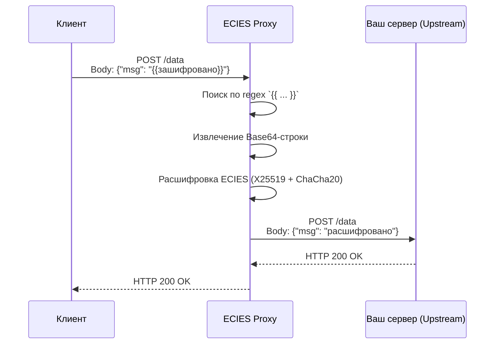
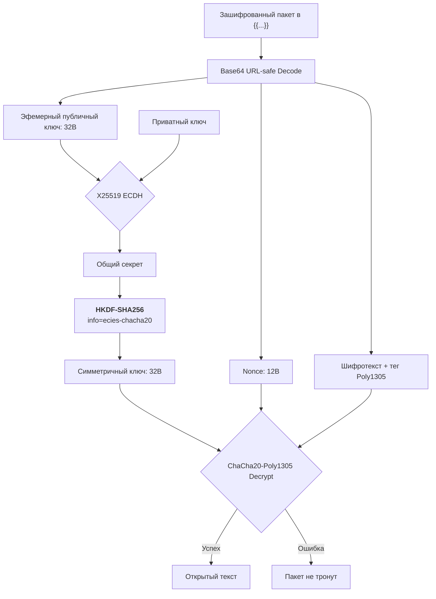
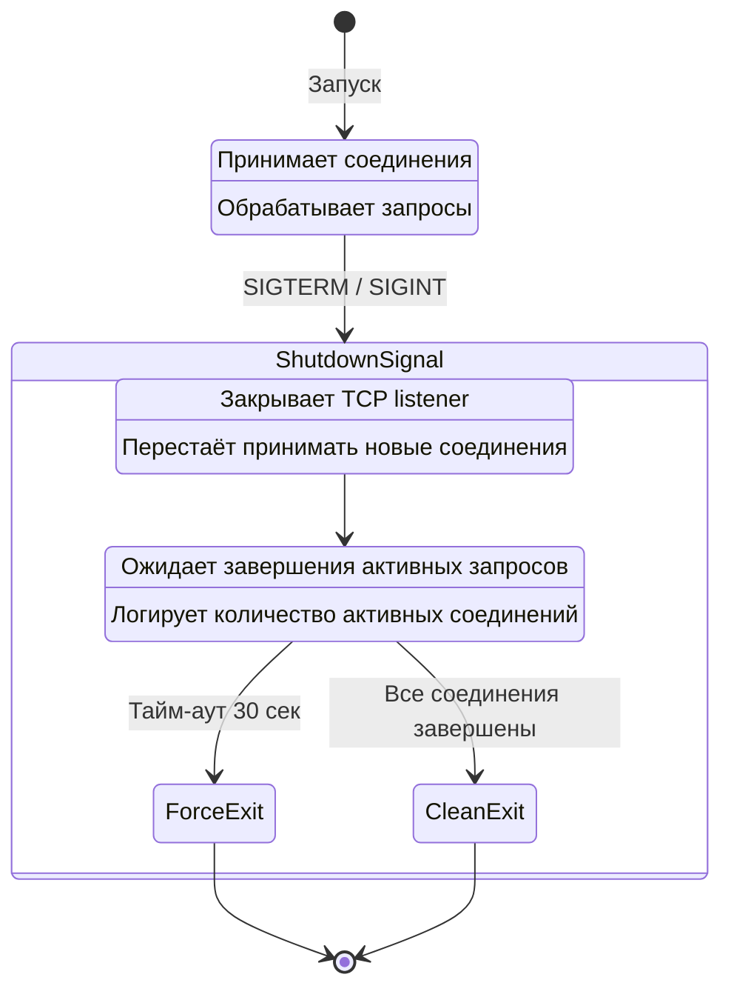

```markdown
# 🔐 ECIES Reverse Proxy

[](https://www.rust-lang.org/)
[](https://www.docker.com/)
[](https://opensource.org/licenses/MIT)

Высокопроизводительный асинхронный прокси‑сервер для прозрачной расшифровки ECIES‑пакетов в HTTP‑трафике.  
Позволяет развернуть end‑to‑end шифрование, не меняя исходный код ваших сервисов.

---

## 📖 Содержание

- [Принцип работы](#-принцип-работы)
- [Алгоритмы шифрования](#-алгоритмы-шифрования)
- [Ключевые преимущества](#-ключевые-преимущества)
- [Отказоустойчивость](#-отказоустойчивость)
- [Быстрый старт](#-быстрый-старт)
- [Конфигурация](#-конфигурация)
- [Пример использования](#-пример-использования)
- [Лицензия](#-лицензия)

---

## 🧠 Принцип работы

Прокси перехватывает HTTP‑запросы, находит в теле зашифрованные блоки вида `{{Base64URL_Safe_String}}`, расшифровывает их с помощью вашего приватного ключа X25519 и передаёт уже открытые данные на конечный сервер (upstream).  
Ваше приложение получает чистые данные, а клиент может не беспокоиться о том, что его трафик будет раскрыт — вся магия происходит в контейнере.



---

## 🔐 Алгоритмы шифрования

Прокси реализует схему **ECIES** (Elliptic Curve Integrated Encryption Scheme) — одну из самых современных и быстрых схем асимметричного шифрования.

| Компонент | Алгоритм | Детали |
|-----------|----------|--------|
| **Соглашение о ключе** | X25519 (Curve25519) | Обмен 32‑байтными ключами. ~128 бит стойкости. |
| **Производный ключ** | HKDF‑SHA256 | info = `"ecies-chacha20-poly1305"` |
| **Симметричное шифрование** | ChaCha20‑Poly1305 | Аутентифицированное шифрование с 256‑битным ключом и 96‑битным nonce |



---

## 🚀 Ключевые преимущества

- 🔒 **End‑to‑End шифрование** – данные остаются зашифрованными до последнего звена перед вашим сервером.
- ⚡ **Высокая производительность** – асинхронный ввод‑вывод на `Tokio` и легковесный HTTP‑сервер `Hyper` позволяют обрабатывать тысячи соединений.
- 🧩 **Прозрачная интеграция** – никаких изменений в бизнес‑логике. Прокси полностью скрыт от остальной системы.
- 🎯 **Точечная замена** – расшифровываются только данные в шаблоне `{{...}}`, остальной контент остаётся нетронутым.
- 🛟 **Отказоустойчивость** – корректное завершение без потери запросов (Graceful Shutdown).
- 📦 **Простое развёртывание** – готовый Docker‑образ, конфигурация через переменные окружения.

---

## 🛡️ Отказоустойчивость

При получении сигнала `SIGTERM` или `SIGINT` прокси **не обрывает** соединения, а плавно завершает работу:

1. Перестаёт принимать новые TCP‑соединения.
2. Ожидает завершения обработки всех активных запросов (до 30 секунд).
3. Только после этого процесс корректно завершается.



Структурированное логирование позволяет наблюдать за состоянием через `docker compose logs`.

---

## 🏁 Быстрый старт

### 1. Получите приватный ключ ECIES

Для работы прокси необходим **приватный ключ**, соответствующий тому публичному ключу, которым шифруются данные.  
Сгенерировать пару ключей можно несколькими способами:

**С помощью Python (рекомендуется):**
```bash
pip install cryptography
python3 -c "
from cryptography.hazmat.primitives.asymmetric.x25519 import X25519PrivateKey
import base64
private_key = X25519PrivateKey.generate()
private_b64 = base64.urlsafe_b64encode(private_key.private_bytes_raw()).decode().rstrip('=')
public_b64 = base64.urlsafe_b64encode(private_key.public_key().public_bytes_raw()).decode().rstrip('=')
print('Приватный ключ (сохраните его):', private_b64)
print('Публичный ключ (передайте клиентам):', public_b64)
"
```

**С помощью компоненты 1С (OpenIntegrations):**
```1c
ECIES = Новый("AddIn.OPI_ECIES.Main");
КлючиJSON = ECIES.GenerateKeyPair();
// Разберите JSON и используйте поле "private"
```

Полученный приватный ключ нужно передать прокси через переменную окружения `ECIES_PRIVATE_KEY`.

### 2. Запустите прокси

**Вариант A: Docker Run**
```bash
docker run -d \
  --name ecies-proxy \
  -p 8080:8080 \
  -e ECIES_PRIVATE_KEY="ваш_приватный_ключ" \
  -e UPSTREAM_URL="http://your-app:80" \
  ghcr.io/grevinden/ecies-reverse-proxy/ecies-proxy:latest
```

**Вариант B: Docker Compose**

Создайте файл `docker-compose.yml`:
```yaml
services:
  proxy:
    image: ghcr.io/grevinden/ecies-reverse-proxy/ecies-proxy:latest
    ports:
      - "8080:8080"
    environment:
      ECIES_PRIVATE_KEY: "ваш_приватный_ключ"
      UPSTREAM_URL: "http://your-app:80"
      LISTEN_ADDR: "0.0.0.0:8080"
    restart: unless-stopped
```

Запустите:
```bash
docker compose up -d
```

---

## ⚙️ Конфигурация

| Переменная окружения | По умолчанию | Описание |
|----------------------|--------------|----------|
| `ECIES_PRIVATE_KEY` | *обязательно* | Приватный ключ ECIES в кодировке URL‑safe Base64 (без `=`). |
| `UPSTREAM_URL` | `http://localhost:8000` | Адрес вашего сервера, куда будут перенаправлены запросы. |
| `LISTEN_ADDR` | `0.0.0.0:8080` | Порт, на котором прокси принимает соединения. |

---

## 📮 Пример использования

Предположим, ваш upstream‑сервер работает на `http://localhost:8000`.  
Клиент отправляет запрос с зашифрованным сообщением:

```bash
curl -X POST http://localhost:8080/ \
  -H "Content-Type: application/json" \
  -d '{"message": "{{зашифрованный_base64_здесь}}"}'
```

Прокси найдёт `{{зашифрованный_base64_здесь}}`, расшифрует его и отправит на upstream:

```json
{
  "message": "секретные данные"
}
```

Ответ от upstream возвращается клиенту без изменений.

---

## 🧪 Проверка работоспособности

1. **Генерация зашифрованного тестового пакета** (можно использовать тот же Python):
   ```python
   from cryptography.hazmat.primitives.asymmetric.x25519 import X25519PrivateKey
   import base64
   # загрузите публичный ключ получателя
   receiver_public = base64.urlsafe_b64decode(public_b64 + '===')
   # ... (используйте реализацию ECIES для шифрования)
   ```

2. **Отправка запроса** `curl` и наблюдение за логами:
   ```bash
   docker compose logs -f
   ```

3. **Остановка**:
   ```bash
   docker compose stop
   ```
   Прокси корректно завершит все активные соединения и выйдет.

---

## 📄 Лицензия

Распространяется под лицензией **MIT**.
